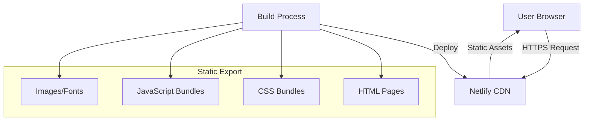
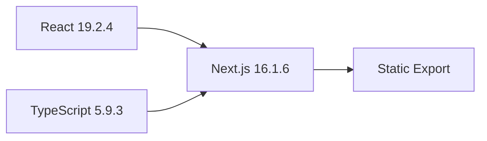
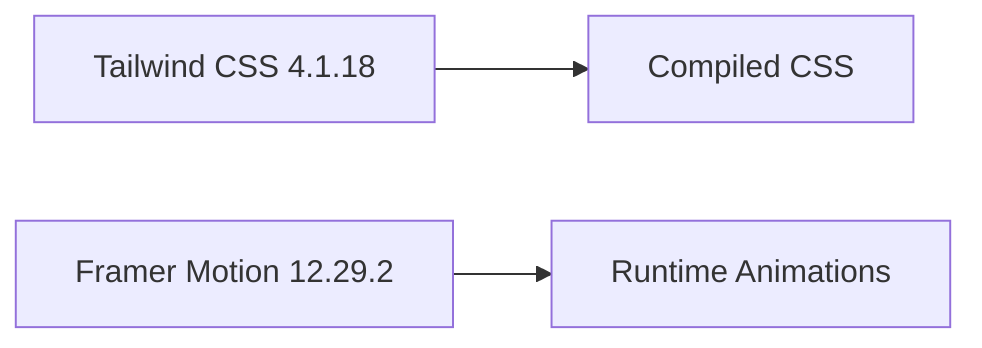
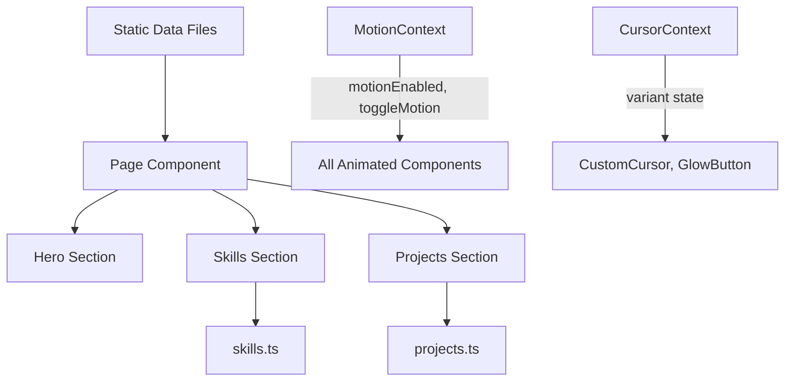
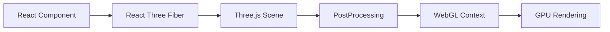

# System Architecture

## Architecture Overview

Elite Portfolio uses a **static-first, component-based architecture** with Next.js App Router, client-side 3D rendering, and zero runtime server dependencies.



## High-Level Architecture

### Rendering Strategy

| Component Type | Rendering | Hydration | Use Case |
|----------------|-----------|-----------|----------|
| Server Components | Build Time | None | Layout, metadata, static content |
| Client Components | Client Side | Full | Interactive sections, animations |
| 3D Components | Client Side (Dynamic) | Lazy | Three.js visualizations |

**Flow:**
```
Build Time (Next.js) → Static HTML/CSS/JS → CDN (Netlify) → Browser (Client-side hydration)
```

## Technology Stack Layers

### Layer 1: Foundation


**Purpose:** Core framework and type safety
**Build Output:** Static HTML, CSS, JS files to `/out` directory

### Layer 2: Styling & Animation


**Purpose:** Visual design system and motion graphics
**Strategy:**
- Tailwind: Build-time CSS compilation with `@theme` directive
- Framer Motion: Client-side declarative animations

### Layer 3: 3D Rendering & Post-Processing
```mermaid
graph LR
    Three[Three.js 0.182.0] --> R3F[React Three Fiber 9.5.0]
    R3F --> Drei[Drei 10.7.7]
    R3F --> PostProc[@react-three/postprocessing 3.0.4]
    PostProc --> Effects["Bloom, Vignette, ToneMapping"]
    Drei --> Scene[3D Canvas]
    Effects --> Scene
```

**Purpose:** Interactive 3D visualizations with post-processing effects
**Strategy:**
- Three.js: Core WebGL rendering engine
- R3F: React reconciler for Three.js
- Drei: Helper components (PerformanceMonitor, Preload, etc.)
- @react-three/postprocessing: Effect composition (Bloom, Vignette, ToneMapping)

### Layer 4: Deployment
```mermaid
graph LR
    Out[/out directory] --> Netlify[Netlify Build]
    Netlify --> Edge[Edge Network CDN]
    Edge --> Users[Global Users]
```

**Purpose:** Static asset distribution
**Features:**
- Global CDN with edge caching
- Automatic HTTPS
- Instant cache invalidation

## Component Architecture

### Component Hierarchy

```
RootLayout (Server)
└── MotionProvider (Context)
    └── CursorProvider (Context)
        ├── Preloader (Client, AnimatePresence)
        ├── CustomCursor (Client, spring physics)
        ├── EasterEgg (Client, Konami code)
        └── Page (Client)
            ├── StickyNavigation (Dynamic)
            │   ├── ScrollProgress
            │   └── MotionToggleButton
            ├── Hero (Client)
            │   ├── Scene (Dynamic)
            │   │   ├── PerformanceMonitor
            │   │   ├── NeuralNetwork (Custom GLSL Shaders)
            │   │   ├── FloatingParticles (InstancedMesh)
            │   │   └── PostProcessingEffects (Bloom, Vignette)
            │   └── GlowButton × 2
            ├── About (Client)
            │   ├── AnimatedText
            │   └── GlassCard × 5
            ├── Skills (Client)
            │   ├── AnimatedText
            │   └── Scene (Dynamic)
            │       └── SkillOrbit (3D)
            ├── Projects (Client)
            │   ├── AnimatedText
            │   └── BentoCard (Tilt) × N
            ├── Achievements (Client)
            │   └── AnimatedText
            └── Contact (Client)
                ├── GlassCard
                ├── GlowButton
                └── SocialIcons
```

### Component Communication

**Data Flow:** Unidirectional (Props Down) + Context-Based State


**State Management:**
- **Static Data:** Embedded at build time (zero runtime cost)
- **MotionContext:** Global motion toggle (localStorage + system preference)
- **CursorContext:** Cursor variant state (default/hover/click)
- **Local Component State:** useState/useRef for animations, interactions
- **Refs:** useRef for scroll tracking, scene refs, pulse system
- **No External State Library:** React Context sufficient for requirements

### Context System Architecture

**MotionProvider (src/contexts/motion-context.tsx)**
```typescript
interface MotionContextValue {
  motionEnabled: boolean           // Combined system pref + user override
  toggleMotion: () => void         // Switch animations on/off
  systemPrefersReduced: boolean    // Raw system preference
}
```
- Located in RootLayout
- Detects system `prefers-reduced-motion`
- Persists user override to localStorage
- Available to all child components via `useMotionPreference()`
- Used in AnimatedText, scroll animations, 3D rotations

**CursorProvider (src/hooks/use-cursor-state.ts)**
```typescript
type CursorVariant = 'default' | 'hover' | 'click'

interface CursorContextValue {
  variant: CursorVariant
  setDefault: () => void
  setHover: () => void
  setClick: () => void
}
```
- Located in RootLayout (after MotionProvider)
- Manages custom cursor visual state
- Consumed by CustomCursor component
- GlowButton, BentoCard trigger setHover/setClick

**Custom Hooks for Performance State**
- `usePerformanceDegradation()`: Returns perfLevel (0-4) + degrade function
- `useDevicePerformance()`: Returns tier (low/mid/high) + isMobile flag
- `usePulseSystem()`: Manages up to 5 concurrent shockwaves
- `useReducedMotion()`: Returns system preference boolean

### Component Types & Patterns

#### Server Components (Build-Time)
```typescript
// app/layout.tsx, app/page.tsx
export default function Layout({ children }: Props) {
  // Runs at build time only
  return <html>{children}</html>
}
```

**Characteristics:**
- No JavaScript in browser
- SEO-friendly
- Instant metadata generation

#### Client Components (Hydration)
```typescript
'use client'

export default function Hero() {
  // Runs in browser
  const [scrollY, setScrollY] = useState(0)
  return <motion.div>{/* Interactive content */}</motion.div>
}
```

**Characteristics:**
- Full React interactivity
- Event handlers
- useState, useEffect hooks

#### Dynamic 3D Components (Lazy-Loaded)
```typescript
const Scene = dynamic(() => import('@/components/3d/Scene'), {
  ssr: false,
  loading: () => <Loader />
})
```

**Characteristics:**
- Code-split bundle
- Loaded on client only
- Prevents build-time errors (window/WebGL not available)

## Data Architecture

### Static Data Layer

**Structure:**
```
src/data/
├── skills.ts          # 7 categories, 30+ skills
├── projects.ts        # 4 projects with metadata
└── achievements.ts    # 4 achievements with dates
```

**Pattern:**
```typescript
// Define type
export interface Skill {
  id: string
  name: string
  category: string
  level: number
}

// Export data
export const skills: Skill[] = [...]

// Export derived data
export const featuredSkills = skills.filter(s => s.level >= 90)
```

**No API Layer:**
- All data embedded at build time
- No fetch calls
- No database connections
- No environment variables required

### Type System

**Co-located Types:**
```
skills.ts       → export interface Skill
projects.ts     → export interface Project
achievements.ts → export interface Achievement
```

**Shared Types:**
- None needed (no type reuse across domains)
- Each data file owns its types

## 3D Rendering Architecture

### WebGL Pipeline



### Scene Graph (NeuralNetwork with Enhanced Features)

```
Canvas (R3F)
└── Scene
    ├── PerspectiveCamera (FOV: 50, near: 0.1, far: 1000)
    ├── PerformanceMonitor (flipflops: 3, adaptive bounds)
    ├── NeuralNetwork (ShaderMaterial-based)
    │   ├── BufferGeometry (400-10000 nodes, adaptive)
    │   ├── ShaderMaterial (Custom GLSL)
    │   │   ├── Vertex Shader
    │   │   └── Fragment Shader
    │   └── useFrame animation loop
    ├── FloatingParticles (InstancedMesh)
    │   ├── Count: 500-10000 (based on device tier)
    │   └── Indexed positions, velocity updates
    └── PostProcessingEffects
        ├── EffectComposer
        ├── Bloom (luminanceThreshold: 0.2)
        ├── Vignette (darkness adaptive)
        └── ToneMapping
```

### Performance Architecture

**Device Detection & Degradation Levels:**
```typescript
// 5-level progressive degradation system
Level 0: High   - All effects enabled, 10k particles, bloom+vignette
Level 1: Mid    - All effects enabled, 5k particles
Level 2: Low    - Bloom disabled, 2k particles, vignette only
Level 3: Minimal- Bloom disabled, 1k particles
Level 4: Emergency - All effects disabled, 500 particles, no PostProcessing
```

**Device Tier Detection:**
- GPU capability via WebGL debug extension
- CPU cores (navigator.hardwareConcurrency)
- Mobile detection (user agent)
- Initial tier: high → mid → low based on device

**Frame Loop:**
```
requestAnimationFrame
└── useFrame (R3F)
    ├── Update particle positions (InstancedMesh)
    ├── Update shader uniforms (time, pulse state)
    ├── Update NeuralNetwork rotation (breathing)
    ├── Pulse shockwave propagation (up to 5 concurrent)
    └── Mouse attraction physics
```

**Pulse System:**
- Up to 5 concurrent shockwaves
- GPU-accelerated via shader uniforms
- Driven by useFrame with physics simulation
- Konami code trigger (EasterEgg)

**Optimization Strategies:**
1. **InstancedMesh:** Particles rendered as single draw call
2. **Custom ShaderMaterial:** GPU-accelerated node rendering
3. **Conditional PostProcessing:** Disabled in degradation levels 3+
4. **DPR Capping:** [0.5, 1] when degraded, [1, 2] normal
5. **Frustum Culling:** Automatic (Three.js)
6. **Preload:** Drei.Preload for asset caching

## Animation Architecture

### Framer Motion Integration

**Pattern 1: Entrance Animations (Viewport-Triggered)**
```typescript
<motion.div
  initial={{ opacity: 0, y: 20 }}
  whileInView={{ opacity: 1, y: 0 }}
  viewport={{ once: true, margin: "-50px" }}
/>
```
**Trigger:** IntersectionObserver via Framer's `whileInView`
**Performance:** GPU-accelerated transforms, no layout thrashing

**Pattern 2: Word-by-Word Text Reveal (AnimatedText)**
```typescript
const container = {
  hidden: { opacity: 0 },
  show: {
    opacity: 1,
    transition: {
      staggerChildren: 0.03,
      delayChildren: 0.2,
    },
  },
}

const item = {
  hidden: { opacity: 0, y: 10 },
  show: { opacity: 1, y: 0 }
}
```
**Implementation:** Framer Motion variants with staggered children
**Used In:** About, Skills, Projects, Achievements sections

**Pattern 3: Scroll-Linked Animations**
```typescript
const { scrollYProgress } = useScroll()
const opacity = useTransform(scrollYProgress, [0, 150], [1, 0])

<motion.div style={{ opacity }} />
```
**Trigger:** Scroll event (throttled by Framer)
**Performance:** RequestAnimationFrame-based updates

**Pattern 4: Hover/Interaction (Spring Physics)**
```typescript
<motion.button
  whileHover={{ scale: 1.05 }}
  whileTap={{ scale: 0.95 }}
  transition={{ type: "spring", stiffness: 300 }}
/>
```
**Trigger:** Mouse/touch events
**Performance:** CSS transforms only

**Pattern 5: Magnetic Effect & Cursor Tracking**
- Custom magnetic effect hook (useMagneticEffect)
- Mouse position tracking with useMotionValue
- Spring physics for smooth following
- Used in GlowButton, BentoCard components

**Pattern 6: 3D CSS Tilt (BentoCard)**
- perspective transform on interaction
- Mouse position-based rotation
- Smooth easing applied

### Reduced Motion Compliance

All animated components respect `prefers-reduced-motion`:
```typescript
const prefersReducedMotion = useReducedMotion()
// Conditionally disable animations based on user preference
```

Integration points:
- MotionProvider respects system preference + localStorage override
- AnimatedText skips stagger in reduced-motion mode
- Scroll animations simplified to opacity-only
- 3D rotations disabled for accessibility

## Build Architecture

### Build Process Flow

```mermaid
graph TD
    Source[Source Code] --> TypeScript[TypeScript Compilation]
    TypeScript --> Next[Next.js Build]
    Next --> React[React Server Components]
    React --> HTML[Static HTML]
    Next --> Tailwind[Tailwind Processing]
    Tailwind --> CSS[Compiled CSS]
    Next --> Bundle[JavaScript Bundling]
    Bundle --> JS[Optimized JS]

    HTML --> Out[/out directory]
    CSS --> Out
    JS --> Out
    Assets[Images/Fonts] --> Out

    Out --> Deploy[Netlify Deploy]
```

### Build Commands

```bash
npm run build
  ↓
next build
  ↓
1. TypeScript type checking
2. React component compilation
3. Tailwind CSS processing
4. JavaScript bundling (Webpack/Turbopack)
5. Static page generation
6. Asset optimization
  ↓
Output: /out directory (static files)
```

### Build Output Structure

```
out/
├── index.html              # Main page
├── _next/
│   ├── static/
│   │   ├── chunks/         # JavaScript bundles
│   │   └── css/            # Compiled CSS
│   └── data/               # Build metadata
├── images/                 # Public assets
└── icon.svg                # Favicon
```

**Bundle Splitting:**
- Main bundle: React + Next.js runtime
- Route bundles: Page-specific code
- Shared bundles: Common dependencies
- Dynamic chunks: 3D components (lazy-loaded)

## Deployment Architecture

### Netlify Configuration

**netlify.toml:**
```toml
[build]
  command = "npm run build"
  publish = "out"

[[plugins]]
  package = "@netlify/plugin-nextjs"
```

**Plugin Responsibilities:**
- Next.js-specific optimizations
- Asset fingerprinting
- Cache headers

### CDN Strategy

**Edge Network:**
- 100+ global PoPs (Points of Presence)
- Automatic geo-routing
- HTTP/2 + HTTP/3 support

**Caching Strategy:**
```
HTML:        Cache-Control: public, max-age=0, must-revalidate
CSS/JS:      Cache-Control: public, max-age=31536000, immutable
Images:      Cache-Control: public, max-age=31536000, immutable
```

**Cache Invalidation:**
- Automatic on new deploy
- Fingerprinted assets (never need invalidation)

## Security Architecture

### Threat Model

**No Server = Minimal Attack Surface**
- No backend to compromise
- No database to inject into
- No API keys to steal

### Security Layers

**1. HTTPS Enforcement:**
```
All traffic encrypted (TLS 1.3)
Automatic certificate renewal (Let's Encrypt)
HSTS headers enabled
```

**2. Content Security Policy (Future):**
```http
Content-Security-Policy:
  default-src 'self';
  script-src 'self' 'unsafe-inline';
  style-src 'self' 'unsafe-inline';
  img-src 'self' data: https:;
  connect-src 'self';
```

**3. Dependency Security:**
```bash
npm audit          # Regular scans
Dependabot         # Automatic PRs for updates
```

**4. No Secrets:**
- All code is public (portfolio purpose)
- No `.env` files
- No API keys

## Performance Architecture

### Loading Strategy

**Critical Path:**
```
1. HTML (10KB)
2. Critical CSS (inline, ~5KB)
3. React runtime (~50KB gzipped)
4. Main bundle (~100KB gzipped)
5. Fonts (preloaded, ~30KB)
```

**Below-the-Fold:**
```
6. 3D components (lazy-loaded, ~200KB)
7. Images (lazy-loaded)
8. Animation libraries (already loaded)
```

### Optimization Techniques

| Technique | Implementation | Impact |
|-----------|---------------|--------|
| Code Splitting | Dynamic imports | -60% initial bundle |
| Tree Shaking | ES modules | -30% unused code |
| Minification | Terser | -40% file size |
| Compression | Gzip/Brotli | -70% transfer size |
| Font Loading | display: swap | No FOIT |
| Image Lazy Load | loading="lazy" | -50% initial load |

### Monitoring Points

**Build-Time Metrics:**
- Bundle size analysis
- Lighthouse CI scores
- TypeScript compilation time

**Runtime Metrics (Future):**
- Core Web Vitals (LCP, FID, CLS)
- 3D frame rate (FPS)
- Memory usage (Chrome DevTools)

## Scalability Architecture

### Horizontal Scalability

**CDN:** Infinite edge nodes
**Build:** Netlify build servers auto-scale

**No Bottlenecks:**
- No database connections
- No API rate limits
- No server capacity

### Content Scalability

**Current Load:**
- 7 skill categories
- 30+ skills
- 4 projects
- 4 achievements

**Scalability Limits:**
- **Skills:** Can handle 100+ without re-architecture
- **Projects:** 20+ may need pagination
- **Achievements:** 20+ may need timeline virtualization

**Mitigation:**
- Lazy load off-screen content
- Virtual scrolling for long lists
- Archive old achievements

## Error Handling Architecture

### Build-Time Errors

**TypeScript:**
```
Compile fails → Fix types → Rebuild
```

**Linting:**
```
ESLint errors → Auto-fix or manual → Rebuild
```

**Build Errors:**
```
Next.js error → Check logs → Fix code → Rebuild
```

### Runtime Errors

**3D Component Failures:**
```typescript
<ErrorBoundary fallback={<StaticImage />}>
  <Scene />
</ErrorBoundary>
```

**Network Errors:**
- None (no network requests)
- Font loading fallback: System fonts

**Browser Compatibility:**
```typescript
if (!window.WebGLRenderingContext) {
  return <FallbackMessage />
}
```

## Future Architecture Considerations

### Blog Integration (Potential)

**New Layer: Content Management**
```
src/content/
├── posts/
│   └── *.mdx
└── remark/rehype plugins
```

**Architecture Changes:**
- Keep static export
- MDX compilation at build time
- No CMS, Git-based content

### Analytics Integration (Potential)

**Privacy-First:**
- Plausible or Fathom (cookieless)
- Script tag in layout
- No tracking pixels

**Impact:**
- +3KB script
- No privacy concerns
- GDPR compliant

## Architecture Principles

1. **Static First:** Always prefer build-time over runtime
2. **Component Isolation:** Each component is self-contained
3. **Progressive Enhancement:** Core content works without JS
4. **Performance Budget:** 500KB total JS, 60fps animations
5. **Type Safety:** Zero `any` types, full TypeScript coverage
6. **Accessibility:** WCAG AA compliance
7. **Security:** Minimal attack surface, no secrets
8. **Maintainability:** Clear separation of concerns

## Dependency Graph

```mermaid
graph TD
    Next[next] --> React[react]
    Next --> ReactDOM[react-dom]

    Tailwind[tailwindcss] --> PostCSS[postcss]
    Tailwind --> AutoPrefixer[autoprefixer]

    R3F[@react-three/fiber] --> Three[three]
    R3F --> React

    Drei[@react-three/drei] --> R3F
    Drei --> Three

    PostProc[@react-three/postprocessing] --> R3F
    PostProc --> Three

    Motion[framer-motion] --> React

    Utils[lib/utils] --> clsx
    Utils --> tailwind-merge
```

**Total Dependencies:** 16 production + 6 dev
**Bundle Impact:** ~480KB gzipped (including 3D + post-processing)
**New Addition:** @react-three/postprocessing 3.0.4 (adds ~30KB for Bloom, Vignette, ToneMapping)

## Summary

Elite Portfolio architecture is optimized for:

**Core Pillars:**
- **Zero runtime cost** (static export)
- **Maximum performance** (code splitting, lazy loading, progressive degradation)
- **Developer experience** (TypeScript, Tailwind, Framer Motion)
- **Scalability** (CDN distribution, no server bottlenecks)
- **Maintainability** (clear component hierarchy, type safety, modular context system)
- **Accessibility** (prefers-reduced-motion, semantic HTML, keyboard support)

**Implemented Enhancements:**
- Custom GLSL shaders for neural network rendering (Synaptic Ripple)
- 5-level performance degradation system (high → mid → low → minimal → emergency)
- Post-processing effects (Bloom, Vignette, ToneMapping)
- Floating particles with InstancedMesh
- Pulse shockwave system (up to 5 concurrent)
- Custom cursor with spring physics
- Konami code easter egg (7-key sequence trigger)
- Word-by-word text animations (stagger)
- Magnetic button effects
- Sticky navigation with scroll progress
- Device performance detection and adaptive quality

**Context System:**
- MotionProvider: Global animation toggle (localStorage + system preference)
- CursorProvider: Cursor state management
- Performance hooks: Device detection, degradation levels, pulse system

The architecture supports future enhancements (blog, analytics) without major refactoring.
